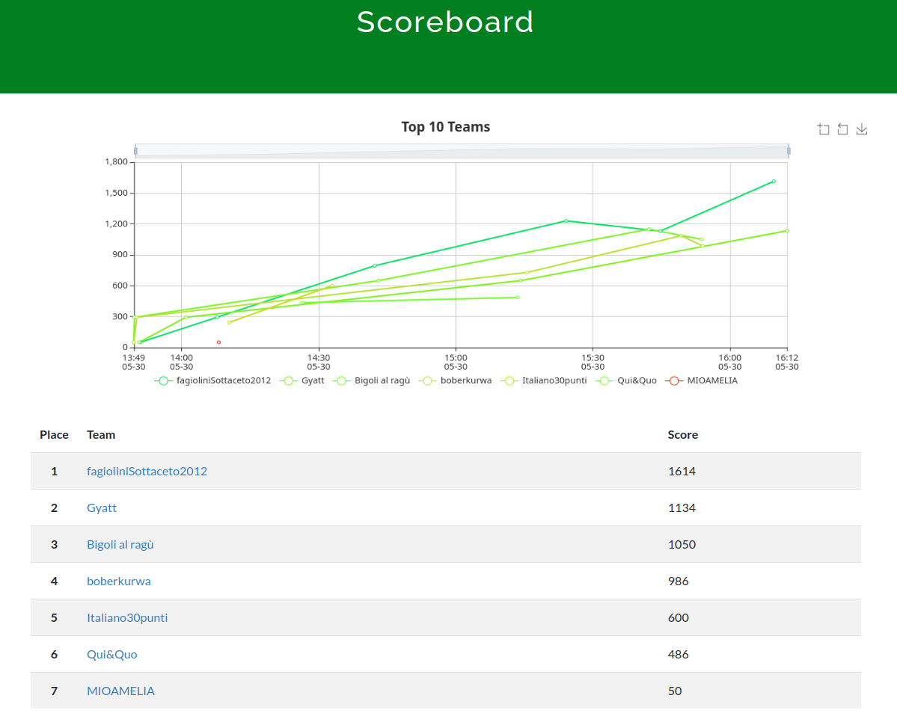

# rossiCTF
Capture The Flag a squadre per principianti interna all' ITIS A. Rossi (30/05/2025)

|   n | categoria | challenge                                                                                        | autore       | soluzioni |
| --: | :-------- | :----------------------------------------------------------------------------------------------- | -----------: | --------: |
|   1 | misc      | [sanity check](https://github.com/tommasotode/rossiCTF/tree/main/challs/misc/sanitycheck)        | @tode        |         6 |
|   2 | misc      | [stampante](https://github.com/tommasotode/rossiCTF/tree/main/challs/misc/stampante)             | @tode        |         5 |
|   3 | misc      | [strangecloud](https://github.com/tommasotode/rossiCTF/tree/main/challs/misc/strangecloud)       | @tode        |         0 |
|   4 | misc      | [calc1](https://github.com/tommasotode/rossiCTF/tree/main/challs/misc/calc1)                     | @barban      |         4 |
|   5 | misc      | [calc2](https://github.com/tommasotode/rossiCTF/tree/main/challs/misc/calc2)                     | @barban      |         0 |
|   6 | osint     | [fuga](https://github.com/tommasotode/rossiCTF/tree/main/challs/misc/fuga)                       | @tode        |         2 |
|   7 | crypto    | [vigenerhash](https://github.com/tommasotode/rossiCTF/tree/main/challs/crypto/vigenerhash)       | @tode        |         1 |
|   8 | binary    | [indecifrabile](https://github.com/tommasotode/rossiCTF/tree/main/challs/binary/indecifrabile)   | @tode        |         3 |
|   9 | binary    | [pswgenerator](https://github.com/tommasotode/rossiCTF/tree/main/challs/binary/pswgenerator)     | @tode        |         0 |
|  10 | web       | [ssl](https://github.com/tommasotode/rossiCTF/tree/main/challs/web/ssl)                          | @barban      |         0 |
|  11 | web       | [yourAPI](https://github.com/tommasotode/rossiCTF/tree/main/challs/web/yourAPI)                  | @tode        |         1 |
|  12 | web       | [evilrandom](https://github.com/tommasotode/rossiCTF/tree/main/challs/web/evilrandom)            | @tode        |         0 |

## Risultati
**Classifica finale**

## Hosting
Per hostare:
`docker compose up --build`

Per risolvere le challenge senza soluzione:  
Scaricare `text.txt` e gli allegati (`attachments/`) se presenti.