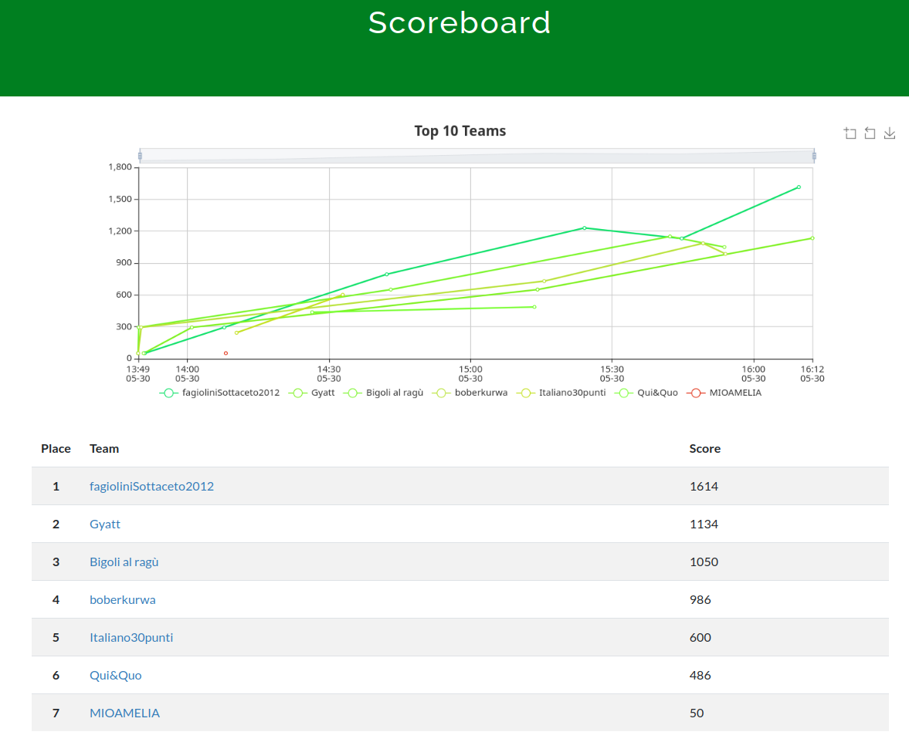

# rossiCTF
Capture The Flag a squadre per principianti interna all' ITIS A. Rossi (30/05/2025)

|   n | categoria | challenge                                                                                        |  soluzioni   |
| --: | :-------- | :----------------------------------------------------------------------------------------------- | -----------: |
|   1 | misc      | [sanity check](https://github.com/tommasotode/rossiCTF/tree/main/challs/misc/sanitycheck)        |            6 |
|   2 | misc      | [stampante](https://github.com/tommasotode/rossiCTF/tree/main/challs/misc/stampante)             |            5 |
|   3 | misc      | [strangecloud](https://github.com/tommasotode/rossiCTF/tree/main/challs/misc/strangecloud)       |            0 |
|   4 | misc      | [calc1](https://github.com/tommasotode/rossiCTF/tree/main/challs/misc/calc1)                     |            4 |
|   5 | misc      | [calc2](https://github.com/tommasotode/rossiCTF/tree/main/challs/misc/stampante)                 |            0 |
|   6 | osint     | [fuga](https://github.com/tommasotode/rossiCTF/tree/main/challs/misc/fuga)                       |            2 |
|   7 | crypto    | [vigenerhash](https://github.com/tommasotode/rossiCTF/tree/main/challs/crypto/vigenerhash)       |            1 |
|   8 | binary    | [indecifrabile](https://github.com/tommasotode/rossiCTF/tree/main/challs/binary/indecifrabile)   |            3 |
|   9 | binary    | [pswgenerator](https://github.com/tommasotode/rossiCTF/tree/main/challs/binary/pswgenerator)     |            0 |
|  10 | web       | [ssl](https://github.com/tommasotode/rossiCTF/tree/main/challs/web/ssl)                          |            0 |
|  11 | web       | [yourAPI](https://github.com/tommasotode/rossiCTF/tree/main/challs/web/yourAPI)                  |            1 |
|  12 | web       | [evilrandom](https://github.com/tommasotode/rossiCTF/tree/main/challs/web/evilrandom)            |            0 |

## Risultati
**Classifica finale**

## Hosting
Per hostare:
`docker compose up --build`

Per risolvere le challenge senza soluzione:
Scaricare gli `attachments/` e `text.txt`.