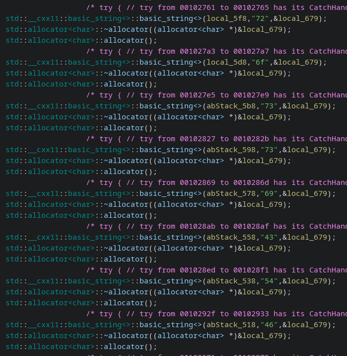

# Indecifrabile (`indecifrabile`)

La challenge consiste in un binario, compilato da un file `c++`.

Questo binario ha molte fonti di distrazione inutili, ma sostanzialmente l'unica parte importante è l'array di stringhe contenente la flag codificata in **esadecimale**, e divisa in blocchetti da due caratteri esadecimali (equivalente di un byte).

L'eseguibile è un po' scomodo da reversare, sia perché è scritto in `c++`, ma soprattutto perché il compilatore ottimizza le stringhe ed elimina le doppie, e non ci permette di tirare fuori i blocchi concatenati e pronti in modo automatico, perché per ogni lettera sarà presente una sola stringa, che verrà usata poi da tutte le sue "ripetizioni".
Tuttavia, è sufficiente con un po' di pazienza disassemblare il binario e prendere i valori dei blocchetti unici (eventualmente anche copiando il contenuto e scriptando velocemente con `python`).

(esempio con `ghidra`)

A questo punto basterà riportarli da `hex` ad `ascii`, e concatenarli in ordine, e avremo ottenuto la flag.

Flag: `rossiCTF{W4iT_h3X_1s_r3vErs4bL3_?!??!!_6fecf1}`