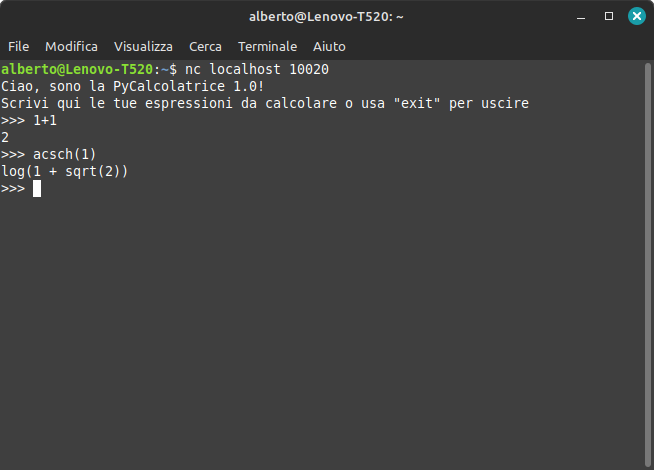
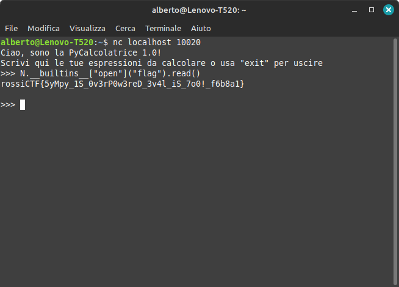

# PyCalcolatrice 1.0 (`calc1`)

Collegandosi al `nc` ci si trova davanti un'interfaccia simile alla REPL Python, che permette di eseguire calcoli anche simbolici e con funzioni avanzate.



Analizzando lo script, all'inizio vengono impostati alcuni limiti sul processo, tra cui:
- Massimo 3 secondi di utilizzo della CPU;
- Massimo 1 processo in esecuzione (cioè non se ne possono lanciare altri);
- Massimo 64 MB di memoria.

Questi limiti servono solo a rendere impossibile che con l'exploit un partecipante possa danneggiare l'ambiente di esecuzione (che comunque è una jail, quindi è completamente isolato dal resto del server, però non si sa mai...).

Le righe da 8 a 10 preparano i `globals` da passare a `parse_expr`: di default SymPy include anche i [`builtins` di Python](https://docs.python.org/3/library/builtins.html), cioè funzioni come `input`, `range` e `open`, che però Alberto vuole impedire che qualcuno utilizzi per rompere la calcolatrice (cioè leggere file...), quindi in questo modo si mette a disposizione dell'utente solo gli oggetti e le funzioni di SymPy (es. `x`, `sin`, `Interval`).

Il resto del programma, invece, si occupa semplicemente di eseguire ripetutamente `parse_expr` con l'input dell'utente, che viene richiesto in modo simile alla REPL Python, mostrando eventuali errori.

A questo punto bisogna fare due deduzioni:
- L'obiettivo è riuscire ad accedere comunque ai `builtins` per leggere la flag (un "sandbox escape");
- Se `parse_expr` prende un parametro `global_dict`, proprio come il parametro `globals` di `eval`, probabilmente ­SymPy ha una vulnerabilità, cioè usa indiscriminatamente `eval` per il parsing dell'espressione.

Una conferma di questa ipotesi proviene dalla [documentazione di `parse_expr`](https://docs.sympy.org/latest/modules/parsing.html#sympy.parsing.sympy_parser.parse_expr):
> Note that this function uses `eval`, and thus shouldn’t be used on unsanitized input.

Quindi ora la parte difficile è capire come ottenere l'oggetto `builtins`.

**Fun fact:** di solito in Python le funzioni hanno un attributo `__builtins__`, che è un dettaglio di implementazione con cui il runtime mette a disposizione i `builtins` all'interno di una funzione. (Per esempio, quando si esegue `input()` in una funzione, questo viene tradotto in `__builtins__.input()`)

Ciò significa che per accedere ai `builtins` è sufficiente trovare una funzione, che però si può cercare solo tra quelle a disposizione, cioè quelle di SymPy. Installando la libreria localmente si può effettuare la ricerca per la funzione col nome più corto da scrivere:

```python
>>> import sympy
>>> sorted((name for name in vars(sympy) if hasattr(getattr(sympy, name), "__builtins__")), key=len)
['N', 'LC', 'LM', 'LT', 'E1', 'fu', 'var', ...]
```

Scrivendo `N.__builtins__`, quindi, si ha i `builtins` sotto forma di dizionario. A questo punto basta accedere a `open`, per leggere la flag con il metodo `read` del file che viene aperto:



Flag: `rossiCTF{5yMpy_1S_0v3rP0w3reD_3v4l_iS_7o0!_f6b8a1}`

**Nota:** non era chiaro che il file si chiamasse solo `flag` e fosse nella cartella attuale; poteva anche essere, per esempio, `/flag` (nella cartella root) o `flag.txt`, quindi abbiamo dovuto chiarirlo durante la gara.
