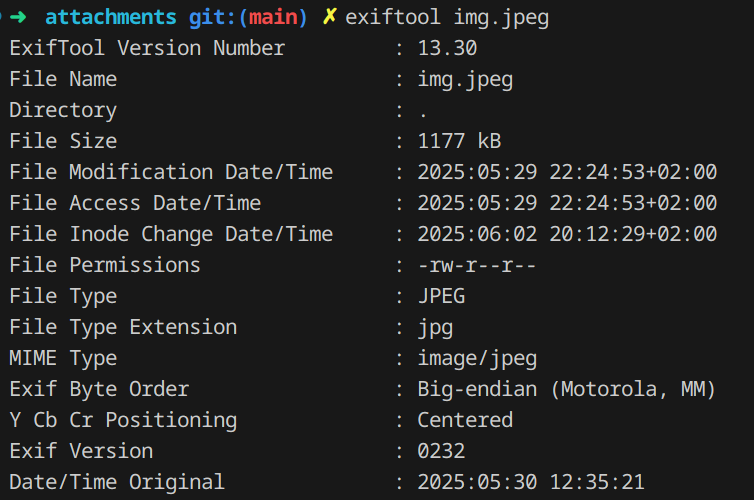

# Fuga (`fuga`)

Abbiamo solamente un'immagine e un testo abbastanza vago, e da queste dobbiamo ricavare tutti i dati necessari per capire la città di arrivo, ovvero:

- L'**aeroporto** dove si trova il nostro amico
- L'**ora** in cui ha scattato la foto
- Le **ore di arrivo** degli **aerei** in partenza da quell'aeroporto
- La sua **ora di arrivo**

Per capire dove si trova l'aeroporto è sufficiente utilizzare tool come `google lens`, per rendersi conto che si tratta di `BGY`, l'aeroporto `Orio al Serio` di Bergamo.

L'ora in cui è stata scattata la foto invece si ricava dai metadati dell'immagine, utilizzando per esempio `exiftool`, e ricavando questo:

`Date/Time Original : 2025:05:30 12:35:21`

A questo punto sappiamo anche l'ora di arrivo (12:35+05:00=17:35) e dobbiamo solo cercare fra gli aerei in arrivo da `BGY` (su [questo](https://www.milanbergamoairport.it/en/real-time-flights/) sito) quelli intorno a quell'ora.

Il più vicino il giorno della gara era quello in arrivo a Napoli alle 17:40, e quindi la flag era rossiCTF{napoli}

Flag: `rossiCTF{napoli}`