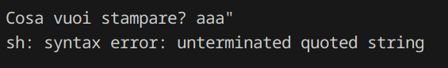

# Stampante (`stampante`)

La challenge implementa un `socket` che ripete quello che scrive l'utente, senza esporre il codice sorgente, ma loggando gli errori all'utente.

La vulnerabilità in questo caso sta in uno **scorretto escaping** dei caratteri, nello specifico delle virgolette, e negli errori che dicono 'troppe cose' sul codice sorgente.

Infatti, è sufficiente scrivere delle ", per ricevere questo errore:



che rivela che stiamo runnando in una shell (`sh`), e che adesso siamo fuori dalla stringa in cui dovremmo essere, permettendoci quindi di avere una `command injection`.

Con un input come `aaa"`, ci troviamo quindi in una situazione del genere (che darà l'errore di prima):

```sh
echo "aaa""
```

A questo punto basterà aggiungere i nostri comandi, e commentare l'ultima virgoletta per rendere la sintassi valida.  
`aaa" && ls #`

```sh
echo "aaa" && ls #"
```

Ricavando i file presenti nella directory, e poi:  
`aaa" && cat flag #`

```sh
echo "aaa" && cat flag #"
```

Ottenendo la flag.

Flag: `rossiCTF{f4sTes7_Pr1nT3r_3V3r_cR34T3d!_be7a68}`