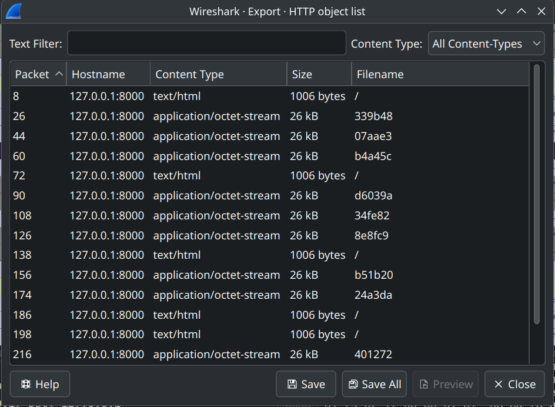
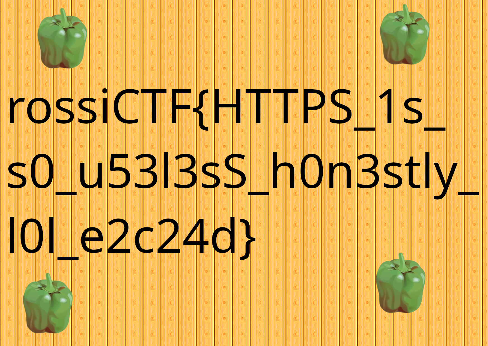

# Strange Cloud (`strangecloud`)

La challenge fornisce un file `cloud.pcapng` contenente principalmente del traffico `HTTP` e `TCP`, analizzabile con tool come `wireshark`.
Le prime cose da notare sono che appunto il traffico non è `HTTPS`, quindi è completamente **in chiaro**, e che il traffico `TCP` è sostanzialmente inutile.

Si possono notare delle richieste `HTTP` a `127.0.0.1` (`localhost`), e possiamo estrarre una pagina `HTML` (seguendo lo stream), con questo contenuto:

```html
<!DOCTYPE html>
<html>
<head>
    <title>Cloud anti-bloatware</title>
</head>
<body>
    <h1>Cloud anti-bloatware</h1>
    <h2>Per questioni di leggerezza, i file possono pesare massimo 26KB<h2>
    <p>flag.png: 287224B diviso in 11 frammenti</p>
    <ul>
        <li><a href="/fragments/339b48">339b48</a></li>
        <li><a href="/fragments/07aae3">07aae3</a></li>
        ...
    </ul>
</body>
</html>
```

che ci chiarisce un po' le idee.
A questo punto sappiamo che il `.pcap` contiene un download di un'immagine `.png` divisa in 11 blocchi da circa `26KB` ciascuno.

Il passo successivo è quindi estrarre queste immagini, ed il modo più comodo per farlo è utilizzando `Extract HTTP object` di `wireshark`.



A questo punto, ci accorgiamo che i pezzi di foto non sono ordinati, e ci troviamo a dover potenzialmente brutare `11!` permutazioni, che richiederebbe senza dubbio un tempo troppo grande.

Per riuscire a brutare l'immagine finale in un tempo ragionevole, è sufficiente accorgersi che possiamo capire quale sia la prima immagine, e potenzialmente anche l'ultima, riducendole di fatto a 10 o 9.
La prima immagine sarà l'unica a renderizzare correttamente, e ad avere i **magic number** del `.png` a inizio file.
L'ultima sarà invece **l'unica** con una **dimensione diversa**, dato che `287224` non è divisibile per `11`.

Fatto questo dobbiamo semplicemente scrivere uno script per brutare al massimo `9!`, che è decisamente fattibile (anche `10!` lo è volendo ma ci mette qualche minuto).

```python
import os
from itertools import permutations
from PIL import Image
from io import BytesIO
from tqdm import tqdm

def solve():
    fragments_dir = "/fragments"
    output_file = "/fragments/reconstructed.png"
    first_name = "first.png"

    fragments = []
    for filename in os.listdir(fragments_dir):
        filepath = os.path.join(fragments_dir, filename)
        if os.path.isfile(filepath):
            with open(filepath, 'rb') as f:
                data = f.read()
                fragments.append((filename, data))
    if not fragments:
        return
    
    first = None
    for i, (fname, data) in enumerate(fragments):
        if fname == first_name:
            first = data
            del fragments[i]
            break
    if first is None:
        return
        
    for perm in tqdm(permutations(fragments)):
        raw = first + b''.join(data for (_, data) in perm)          
        try:
            img = Image.open(BytesIO(raw))
            img.verify()
            with open(output_file, 'wb') as f:
                f.write(raw)
            print(f"Fatto! salvata flag in {output_file}")
            return
        except Exception as e:
            continue
    
    print("\nNessuna immagine valida")
solve()
```

Quando si trova un'immagine valida la si salva, ed ecco la flag.


Flag: `rossiCTF{HTTPS_1s_s0_u53l3sS_h0n3stly_l0l_e2c24d}`