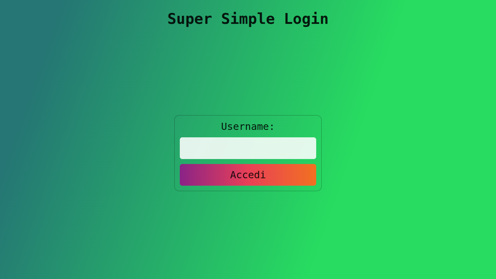
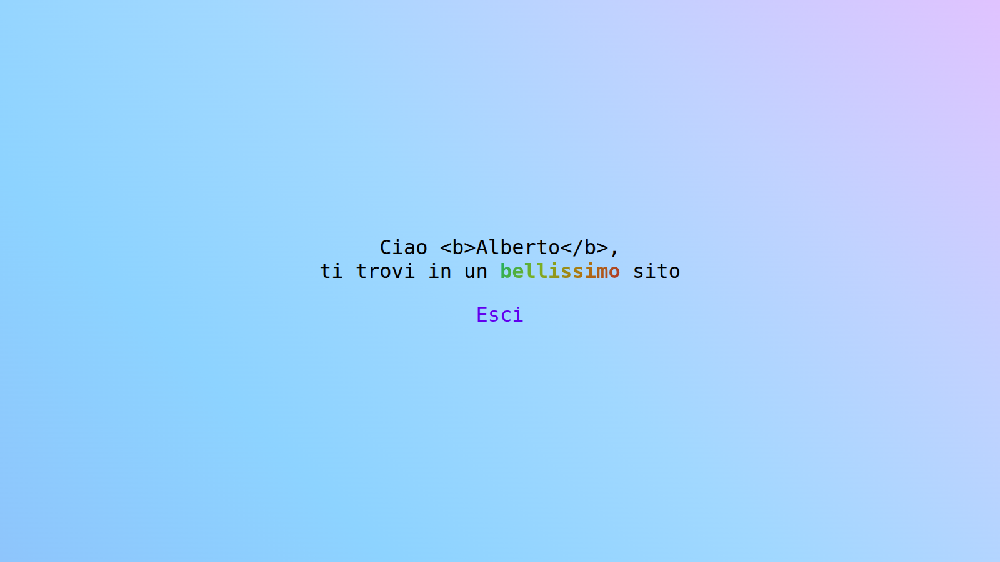
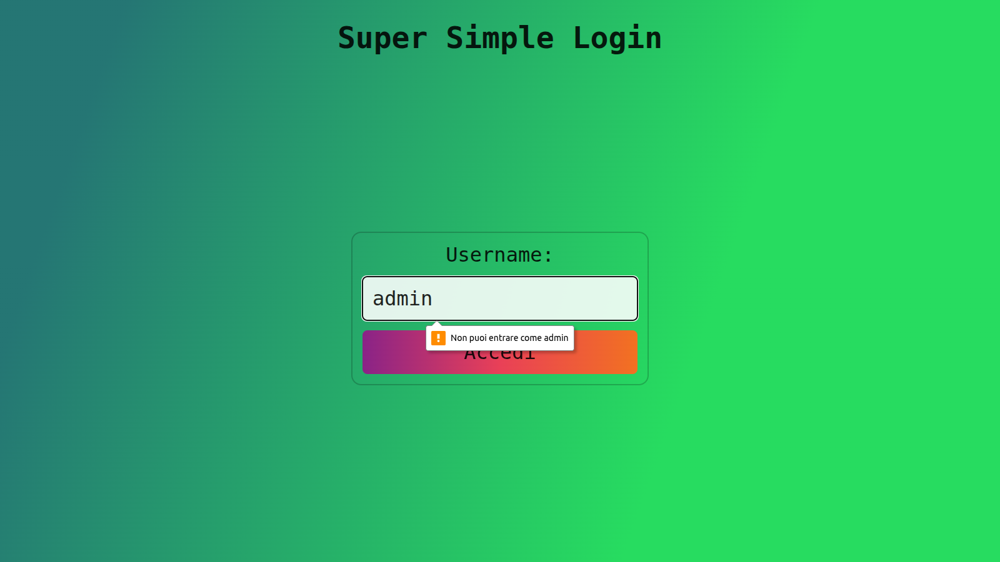
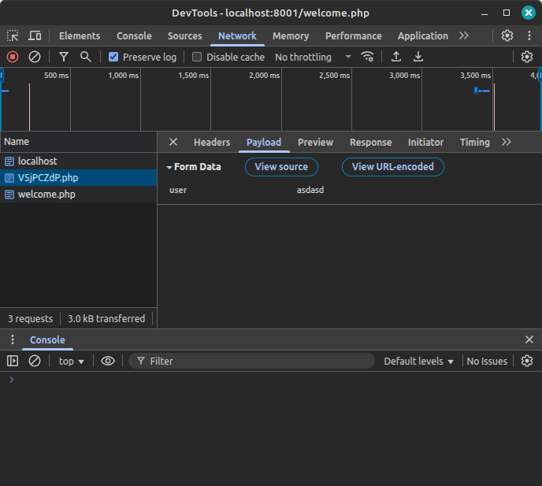
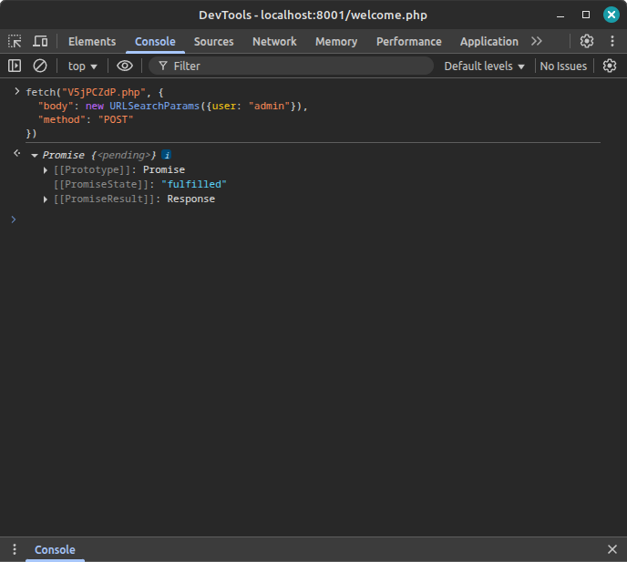
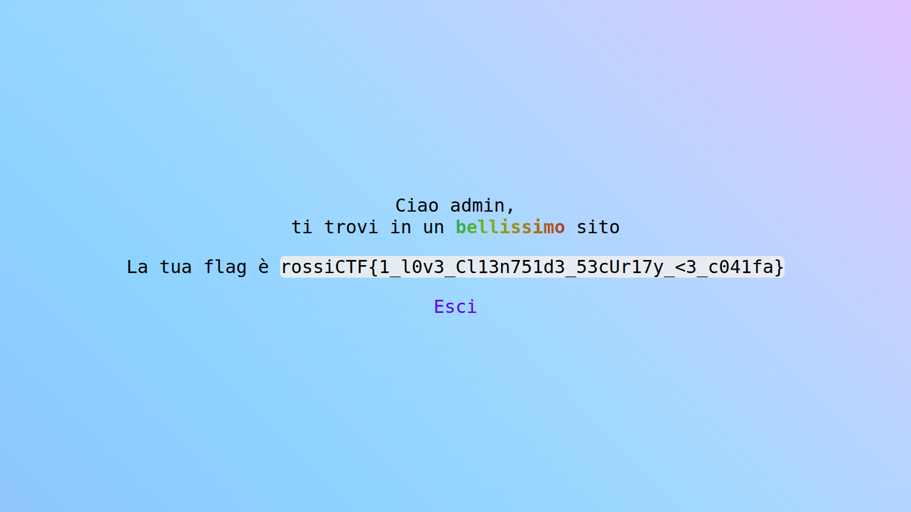

# Super Simple Login (`ssl`)

Aprendo il sito ci si trova davanti un form che richiede solo uno username.

Inserendo un nome qualunque si accede a una pagina `welcome.php` che mostra il nome utente
correttamente escaped. (Non avrebbe neanche senso tentare un attacco XSS, perché tutto avviene lato
client)

L'obiettivo, quindi è accedere alla pagina dell'amministratore, ma inserendo `admin` come nome
utente l'accesso viene impedito lato client.

Si potrebbe provare ad analizzare lo script che blocca l'accesso, ma è offuscato con
[JS Packer](https://www.jspacker.org/); anche se è possibile risalire in poco tempo allo script
originale, è molto più conveniente intercettare la richiesta di login con la sezione Network dei
DevTools e ripeterla mettendo `admin` come nome utente.

**Nota:** è necessario abilitare l'opzione "Preserve log" per impedire che la richiesta di login
venga dimenticata dai DevTools con il passaggio a `welcome.php`.

A questo punto si può riprodurre una richiesta modificata con `fetch` (spoiler: è quello che fa lo
script, dopo il controllo ovviamente).

**Nota:** se si prova a usare `fetch` nella home, la funzione non esiste, perché lo script rimuove
(quasi) tutte le proprietà di `window`, quindi conviene eseguire la richiesta quando ci si trova su
`welcome.php`.

Aggiornando la pagina compare la pagina dell'amministratore, che rispetto a quella di un normale
utente ha una riga in più con la flag.

Flag: `rossiCTF{1_l0v3_Cl13n751d3_53cUr17y_<3_c041fa}`
